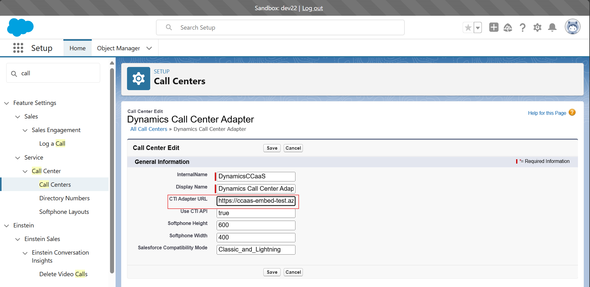

[//]: # "Copyright (c) Microsoft Corporation."
[//]: # "Licensed under the MIT License."

# Project

The Microsoft Dynamics 365 Contact Center is transforming customer engagement through Generative AI technology across various communication channels. It serves as an Copilot-first contact center as a service (CCaaS) solution compatible with preferred CRMs or third-party (3P) software. This add-on enables customers to leverage Dynamics 365 Contact Center along with AI functionalities within their preferred CRM system.

Built upon the Microsoft Azure, Power Platform, and core Dynamics 365 infrastructure, Dynamics 365 Contact Center extends its capabilities by seamlessly integrating CCaaS and AI features with existing 3P solutions. Agents have the flexibility to utilize the add-on in either Embedded mode, where the 3P CRM serves as the primary user experience (UX) with CCaaS/AI functionalities embedded, or Standalone mode, where Dynamics 365 Contact Center plus AI capabilities take precedence while maintaining connectivity with 3P CRM data.

# Prerequisites
1. [Set up D365 Contact Center embedded experience](https://learn.microsoft.com/en-us/dynamics365/contact-center/administer/set-up-embedded-experience)
2. Install Node [latest version](https://nodejs.org/en/download/package-manager)
3. git clone `https://github.com/microsoft/dynamics-365-contact-center.git`

# CTIDriver Setup

The CTI driver serves as a bridge between the Microsoft Omnichannel Add-on and Salesforce CRM, allowing for the integration of telephony features into the CRM environment.
 
**Note:** These steps can be omitted if the default CTIDriver file is used. 

## CTIDriver Extention for Salesforce and ServiceNow

### Salesforce Extension

1. Navigate to /samples/SFExampleCTIDriver

2. Run command `npm install`

3. Open the file /samples/SFExampleCTIDriver/src/SFExampleCTIDriver.ts

4. Implement your desired functionality within any of the methods provided by the ICTIDriver interface.
    Refer to the [Salesforce OpenCTI Methods Documentation](https://developer.salesforce.com/docs/atlas.en-us.api_cti.meta/api_cti/sforce_api_cti_methods_intro_lightning.htm) for available methods and their usage.

5. Run command `npm run build`, dist/SFExampleCTIDriver.js file will get generated inside /SFExampleCTIDriver folder

6. Host the compiled file (dist/SFExampleCTIDriver.js) on a CDN and include the CDN URL as a query parameter in the CCaaS URL.

    Note: It does not need to be a CDN URL, any URL with public access will also work 
     
    The format of the URL should be: 
     
    `https://<example-ccaas-domain>/widget/index.html?dynamicsUrl=https://msdynccaasdev.crm.dynamics.com&ctiDriverUrl=<CDN-url>`
    
    **example-ccaas-domain**: `https://ccaas-embed-prod.azureedge.net` 
     
    Replace `<CDN-url>` with the actual URL of the hosted compiled file on the CDN. 

7. Update the Salesforce Call center definition file (imported in prerequisite) by replacing the `<ctiDriverUrl>` parameter with the URL generated in Step 6.

   
   
8. Your Salesforce Extension integration is now complete and ready to use.

### ServiceNow Extension

1. Navigate to /samples/SNExampleCTIDriver

2. Run command `npm install`

3. Open the file /samples/SNExampleCTIDriver/src/SNExampleCTIDriver.ts

4. Implement your desired functionality within any of the methods provided by the ICTIDriver interface.
    Refer to the [ServiceNow OpenFrame Methods Documentation](https://developer.servicenow.com/dev.do#!/reference/api/washingtondc/client/c_openFrameAPI) for available methods and their usage.

5. Run command `npm run build`, dist/SNExampleCTIDriver.js file will get generated inside /SNExampleCTIDriver folder

6. Host the compiled file (dist/SNExampleCTIDriver.js) on a CDN and include the CDN URL as a query parameter in the CCaaS URL.

    Note: It does not need to be a CDN URL, any URL with public access will also work 
     
    The format of the URL should be: 
     
    `https://<example-ccaas-domain>/widget/index.html?dynamicsUrl=https://msdynccaasdev.crm.dynamics.com&ctiDriverUrl=<CDN-url>`
    
    **example-ccaas-domain**: `https://ccaas-embed-prod.azureedge.net` 
     
    Replace `<CDN-url>` with the actual URL of the hosted compiled file on the CDN. 

7. Add the above url in the respective OpenFrame Configuration as shown in the screenshot below:

   **Url to the list of OpenFrame Configuration:** `https://<ServiceNow-domain>/now/nav/ui/classic/params/target/sn_openframe_configuration_list.do`
   
   

9. Your ServiceNow Extension integration is now complete and ready to use.

[ServiceNow setup Document](./documentation/ServiceNowSetup.md)

## CTIDriver Implementation for Generic CRM 

1. Navigate to `samples/GenericExampleCTIDriver`.

2. Run `npm install` to install the project dependencies.

3. Navigate to `GenericExampleCTIDriver/src/GenericExampleCTIDriver.ts`.

4. Implement the methods defined in `ICTIInterface` according to your CRM requirements.

5. Run `npm run build` to compile the project.

6. Host the compiled file on a CDN. Include the CDN URL as a query parameter in the CCaaS URL. For example, the CCaaS URL format should be:
   `https://<example-ccaas-domain>/widget/index.html?dynamicsUrl=https://msdynccaasdev.crm.dynamics.com&ctiDriverUrl=<CDN-url> `
   Replace `<CDN-url>` with the actual URL of the hosted compiled file on the CDN.
   
   Note: It does not need to be a CDN URL, any URL with public access will also work 

   **example-ccaas-domain**: `https://ccaas-embed-prod.azureedge.net` 

7. Incorporate this URL into the phone/softphone settings of your CRM.

# CCaaS SDK APIs

Refer to the <a href="./documentation/Embed%20SDK%20APIs/README.md">CCaaS SDK README</a> for details on available APIs and how to integrate them.
